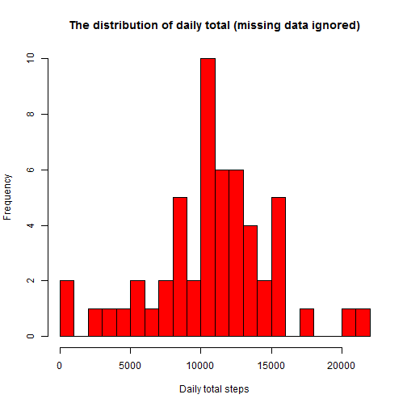
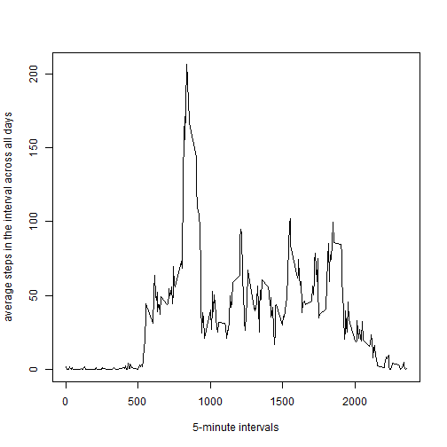
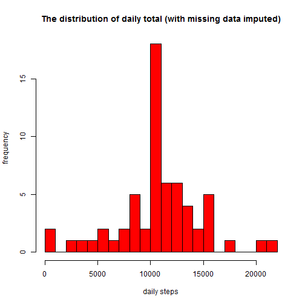

## Loading and preprocessing the data

```r
df <- read.csv("activity.csv")
df$date <- as.Date(df$date)
df_ign <- subset(df, !is.na(df$steps))
```

## What is the mean total number of steps taken per day?

1. Make a histogram of the total number of steps taken each day


```r
dailysum <- tapply(df_ign$steps, df_ign$date, sum, na.rm=TRUE, simplify=T)
dailysum <- dailysum[!is.na(dailysum)]

hist(x=dailysum,
     col="red",
     breaks=20,
     xlab="Daily total steps",
     ylab="Frequency",
     main="The distribution of daily total (missing data ignored)")
```



2. Calculate and report the **mean** and **median** total number of
   steps taken per day


```r
mean(dailysum)
```

```
## [1] 10766.19
```

```r
median(dailysum)
```

```
## [1] 10765
```

## What is the average daily df pattern?

1. Make a time series plot (i.e. `type = "l"`) of the 5-minute
   interval (x-axis) and the average number of steps taken, averaged
   across all days (y-axis)


```r
int_avg <- tapply(df_ign$steps, df_ign$interval, mean, na.rm=TRUE, simplify=T)
df_ia <- data.frame(interval=as.integer(names(int_avg)), avg=int_avg)

with(df_ia,
     plot(interval,
          avg,
          type="l",
          xlab="5-minute intervals",
          ylab="average steps in the interval across all days"))
```



2. Which 5-minute interval, on average across all the days in the
   dataset, contains the maximum number of steps?


```r
max_steps <- max(df_ia$avg)
df_ia[df_ia$avg == max_steps, ]
```

```
##     interval      avg
## 835      835 206.1698
```


## Imputing missing values

1. Calculate and report the total number of missing values in the
   dataset (i.e. the total number of rows with `NA`s)


```r
sum(is.na(df$steps))
```

```
## [1] 2304
```

2. Devise a strategy for filling in all of the missing values in the
   dataset. The strategy does not need to be sophisticated. For
   example, you could use the mean/median for that day, or the mean
   for that 5-minute interval, etc.

I will use the means for the 5-minute intervals as fillers for missing
values.

3. Create a new dataset that is equal to the original dataset but with
   the missing data filled in.


```r
df_impute <- df
ndx <- is.na(df_impute$steps)
int_avg <- tapply(df_ign$steps, df_ign$interval, mean, na.rm=TRUE, simplify=T)
df_impute$steps[ndx] <- int_avg[as.character(df_impute$interval[ndx])]
```

4. Make a histogram of the total number of steps taken each day and
   Calculate and report the **mean** and **median** total number of
   steps taken per day. Do these values differ from the estimates from
   the first part of the assignment? What is the impact of imputing
   missing data on the estimates of the total daily number of steps?


```r
new_dailysum <- tapply(df_impute$steps, df_impute$date, sum, na.rm=TRUE, simplify=T)

hist(x=new_dailysum,
     col="red",
     breaks=20,
     xlab="daily steps",
     ylab="frequency",
     main="The distribution of daily total (with missing data imputed)")
```



The impact of the missing data seems rather low, at least when
estimating the total number of steps per day.


## Are there differences in df patterns between weekdays and weekends?

1. Create a new factor variable in the dataset with two levels --
   "weekday" and "weekend" indicating whether a given date is a
   weekday or weekend day.


2. Make a panel plot containing a time series plot (i.e. `type = "l"`)
   of the 5-minute interval (x-axis) and the average number of steps
   taken, averaged across all weekday days or weekend days
   (y-axis).


```r
# helper function to decide if a day is a week day or not
is_weekday <- function(d) {
    wd <- weekdays(d)
    ifelse (wd == "Saturday" | wd == "Sunday", "weekend", "weekday")
}

wx <- sapply(df_impute$date, is_weekday)
df_impute$wk <- as.factor(wx)
#head(df_impute)

wk_df <- aggregate(steps ~ wk+interval, data=df_impute, FUN=mean)

library(lattice)
xyplot(steps ~ interval | factor(wk),
       layout = c(1, 2),
       xlab="Interval",
       ylab="Number of steps",
       type="l",
       lty=1,
       data=wk_df)
```


